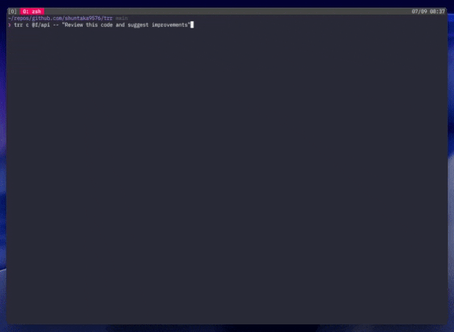

*⚠️  This project is still experimental. Features may change without notice. Use with caution! ⚠️*

# tmux-repo-rsync (trr)

trr is a command-line wrapper around tmux, rsync, and git that simplifies multi-branch development. Instead of using git worktree, trr creates independent development environments by copying your repository for each branch and automatically setting up a dedicated tmux window. This approach provides complete isolation between branches while maintaining a clean and simple workflow.



## Requirements

- tmux
- rsync
- git

## Installation

### Brew (MacOS)

```bash
brew install shuntaka9576/tap/trr
```

### Cargo (git)
```bash
git clone https://github.com/shuntaka9576/trr
cd trr
cargo install --path .
```

## Quick Start

```bash
# Create a new feature branch environment
trr create feature/new-feature

# Pass additional arguments to initialization commands (replaced as @@args)
trr c feature/api -- "Review this code and suggest improvements"
# Using branch alias
trr c @f/api -- "Review this code and suggest improvements"

# Delete environments interactively
trr delete  # or trr d
```

## Configuration

Configuration is managed through a TOML file located at `~/.config/trr/config.toml` (or path specified by `TRR_CONFIG_PATH`).

To initialize or edit the configuration file:

```bash
trr config
```

This command will:
- Create the config file with defaults if it doesn't exist
- Open the file in your editor (using `TRR_EDITOR`, `EDITOR`, or `VISUAL` environment variable)

### Default Configuration

**Note:** These default values are subject to change in future versions. Please check the documentation for the latest defaults when updating.

```toml
[settings]
# Directory where repositories are synced (relative to current directory)
repo_sync_path = ".trr"

# Commands to run after creating new tmux window
# @@args will be replaced with arguments passed after --
tmux_window_init_commands = """
git reset --hard
tmux split-window -h
tmux split-window -v -t 1
tmux send-keys -t 2 'lazygit' C-m
tmux send-keys -t 1 'if [ -n "@@args" ]; then claude --dangerously-skip-permissions "@@args"; else claude; fi' C-m
tmux send-keys -t 0 'nvim' C-m
tmux select-pane -t 1
"""

# Additional directories/files to exclude when copying repositories
# (repo_sync_path is automatically excluded)
rsync_excludes = [
    "target/",
    "node_modules/",
]

[branch_aliases]
# Static aliases
"@f" = "feature"
"@b" = "bugfix"
# Dynamic aliases (prefixed with !)
"@t" = "!echo feature/$(date +%Y%m%d-%H%M%S)"
```

### Configuration Options

| Setting | Description | Default |
|---------|-------------|---------|
| `settings.repo_sync_path` | Directory for storing repository copies | `.trr` |
| `settings.tmux_window_init_commands` | Commands to run in new tmux windows | `""` |
| `settings.rsync_excludes` | Additional directories/files to exclude when copying repositories (repo_sync_path is automatically excluded) | `["target/", "node_modules/"]` |
| `branch_aliases` | Branch name shortcuts | `{}` |

### Environment Variables

| Variable | Description | 
|----------|-------------|
| `TRR_CONFIG_PATH` | Custom config file path (supports `~` expansion) | 
| `TRR_EDITOR` | Editor for config command (highest priority) |
| `EDITOR` | Editor for config command (used if TRR_EDITOR not set) |
| `VISUAL` | Editor for config command (fallback if neither TRR_EDITOR nor EDITOR set) |

